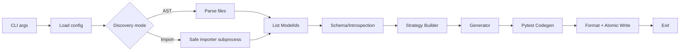
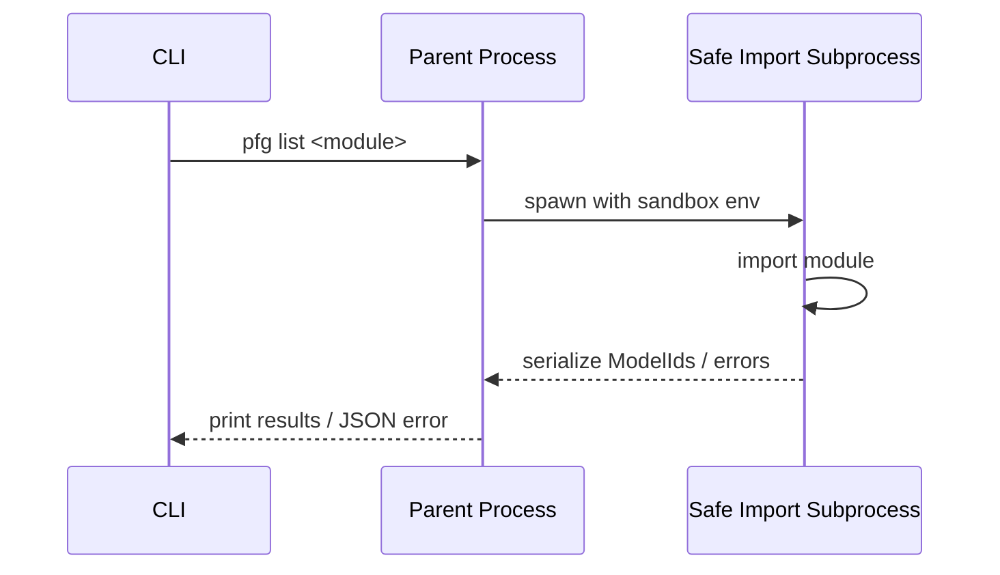
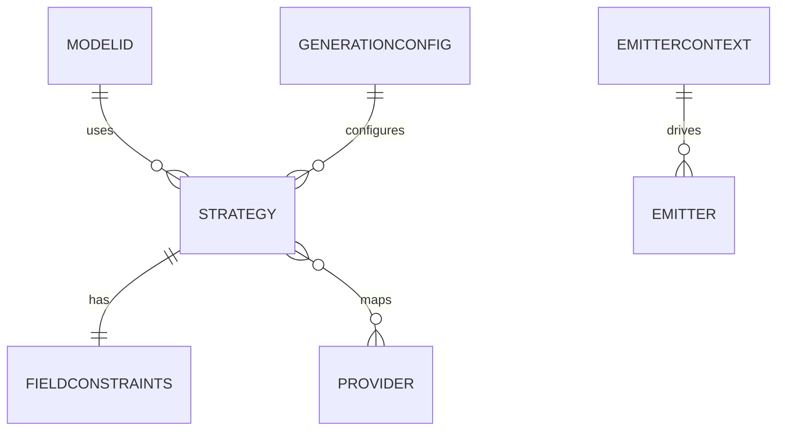

# pydantic-fixturegen — Technical Design

## 1. Architecture Overview

Objective: Deterministically generate fake data from Pydantic v2 models and emit artifacts (pytest fixtures, JSON/JSONL, schema) with a safe CLI and extensible core.

High-level components
- CLI (Typer): entrypoints for `list`, `gen fixtures`, `gen json`, `gen schema`, `doctor`.
- Safe Importer: subprocess-based model discovery/import with resource limits and network blocking.
- AST Discoverer: non-executing discovery to enumerate candidate `BaseModel`/`RootModel` classes.
- Schema/Introspection: extract type info, constraints, and metadata from Pydantic models.
- Strategy Builder: synthesize per-field strategies from types and constraints; apply overrides/policies.
- Provider Registry: map types to providers (Faker, built-ins, optional extras) with deterministic RNG.
- Generator: recursively build model instances, stream results, enforce recursion/graph limits.
- Emitters: codegen for pytest fixtures, JSON/JSONL writers, schema export.
- Config Layer: load/merge config from `pyproject.toml`, YAML, env (`PFG_`), CLI flags.
- Plugin System (Pluggy): provider registration, strategy modification, custom emitters.
- Logging + Error Handling: rich console, structured JSON errors, exit codes.

Data flow
1) Discover models → 2) Build field strategies → 3) Generate instances stream → 4) Emit artifacts → 5) Format + write.

## 2. Boundaries and Responsibilities

- CLI
  - Parse flags, resolve config precedence, route to subcommands.
  - Surface `--json-errors`, exit codes, and verbosity.
- Safe Importer
  - Spawn subprocess with constrained env; import module or symbol.
  - Enforce time/memory limits; return serialized model info.
- AST Discoverer
  - Parse Python files to list class candidates without executing code.
  - Produce `DiscoveryResult` with module/qualname and visibility.
- Schema/Introspection
  - Resolve forward refs, circular deps; extract constraints and field metadata.
  - Normalize Pydantic v2 types to internal `FieldConstraints`.
- Strategy Builder
  - Map types and constraints into `Strategy` objects.
  - Apply policies (`p_none`, union/enum selection), overrides, and plugin hooks.
- Provider Registry
  - Register core providers; load plugin providers; dependency-gated extras.
  - Deterministic RNG plumbing for `random`, Faker, and NumPy.
- Generator
  - Build instances depth-first; enforce recursion depth and object budget.
  - Stream outputs for JSON; return instances for codegen.
- Emitters
  - Pytest codegen with import de-dup, header metadata, Black formatting (via Ruff).
  - JSON/JSONL writers (optionally orjson), sharding, schema export.
- Config Layer
  - Merge `[tool.pydantic_fixturegen]`, YAML, `PFG_*`, and CLI flags (CLI > env > config).
  - Validate schema; expose effective config to subcommands.
- Plugins
  - Hook contracts: register providers, modify strategies, emit artifacts.
  - Isolation: run hooks with guardrails; report failures with context.

## 3. Data Models and Contracts

Core types (conceptual; for clarity, not code):
- ModelId: `{ module: str, qualname: str }`
- DiscoveryResult: `{ models: list[ModelId], warnings: list[str] }`
- FieldConstraints: captures `ge`, `le`, `gt`, `lt`, `min_length`, `max_length`, `pattern`, `min_items`, `max_items`, `unique_items`, `decimal_places`, `max_digits`, etc.
- Strategy: `{ type: Type, constraints: FieldConstraints, provider: ProviderRef, p_none: float, policy: { union, enum } }`
- ProviderRef: `{ name: str, opts: dict }`
- ProviderRegistry: registry indexed by (python type, constraints) → callable provider
- GenerationConfig: `{ seed: int, locale: str, p_none_default: float, recursion_limit: int, object_budget: int, allow_fallback: bool }`
- EmitterContext: `{ seed, tool_version, model_digest, target_path, style, scope, return_type, cases }`
- ErrorObject (for `--json-errors`): `{ code: int, kind: str, message: str, details?: dict, hint?: str }`

JSON error schema (stable)
```
{
  "error": {
    "code": 20,
    "kind": "MappingError",
    "message": "Unsupported constrained type: conipaddress",
    "details": {"field": "ip"},
    "hint": "Install extra [regex] or enable --allow-fallback"
  }
}
```

Plugin hook signatures (conceptual)
- `pfg_register_providers(registry) -> None`
- `pfg_modify_strategy(model: type, field: str, strategy: Strategy) -> Strategy | None`
- `pfg_emit_artifact(kind: Literal["pytest","json","schema"], ctx: EmitterContext) -> bool`

## 4. APIs and Endpoints

CLI commands
- `pfg list <module-or-file> [--ast] [--include ...] [--exclude ...] [--public-only]`
  - Output: model list (text); with `--json-errors` on failure prints ErrorObject.
- `pfg gen fixtures <module-or-model> --out PATH --style {functions,factory,class} --scope {function,module,session} --seed INT --p-none FLOAT [--cases INT] [--ignore-defaults] [--return-type {model,dict}]`
  - Output: Python file; exit 0 on success; non-zero with error codes on failure.
- `pfg gen json <module-or-model> --n INT --out PATH [--jsonl] [--indent {0,2}] [--orjson] [--shard-size INT] --seed INT`
  - Output: JSON or JSONL files; sharded when configured.
- `pfg gen schema <module-or-model> --out PATH`
  - Output: JSON Schema via `model_json_schema()`.
- `pfg doctor <module-or-file> [--ast] [--include ...] [--exclude ...]`
  - Output: coverage and diagnostics; exit 0 unless `--fail-on-warn` set.

Python API (library)
- `generate_instances(Model: type[BaseModel], n: int, seed: int, config?: GenerationConfig) -> Iterable[BaseModel]`
- `emit_pytest_fixtures(models: list[type[BaseModel]], path: str, style: str, scope: str, seed: int, return_type: Literal["model","dict"]) -> None`

Error taxonomy and exit codes
- 10 DiscoveryError, 20 MappingError, 30 EmitError, 40 UnsafeImportViolation (reserved range 1–99 for future).

## 5. State Management and Side Effects

- Deterministic RNG
  - A single master seed seeds: Python `random`, Faker, NumPy (if available).
  - Per-field selection uses deterministic streams keyed by (model, field, index) to ensure stability.
- No persistent app state. All state is per-invocation.
- Side effects
  - File writes for emitted artifacts; use atomic write (temp file + rename) to avoid partials.
  - Subprocess creation for safe imports.
  - Optional Black formatting via Ruff (invoked as a library or subprocess).

## 6. Failure Modes, Retries, Timeouts, Idempotency

- Safe Importer
  - Timeouts (e.g., 10s default) and memory caps; terminate on violation → exit code 40.
  - Network disabled; any attempt raises UnsafeImportViolation.
- Strategy/Generation
  - Unknown/fallback-disabled type → MappingError (20) with hint; `--allow-fallback` yields placeholders.
  - Cycle/recursion overflow → truncate branch to `None` or shallow reference per policy.
- Emitters
  - Black/formatting failures do not corrupt output; emit unformatted or rollback to previous version with a warning.
  - Use content hashing to skip writes if identical (idempotency for fixtures).
- Retries
  - I/O write retried on transient OSErrors (small backoff, limited attempts).

## 7. Security and Privacy Controls

- AuthN/Z: Not applicable (local CLI).
- Safe import sandbox
  - Env: `PYTHONSAFEPATH`, pruned `PYTHONPATH`, cwd jail, `NO_PROXY=*`.
  - Network blocked; time/memory limits; stdout/stderr captured.
  - Disallow writing outside cwd unless explicitly targeted by `--out`.
- Data handling
  - Generated data is synthetic; avoid real PII.
  - Seed and tool version embedded in headers for traceability.
- Plugin safety
  - Run plugin hooks with try/except; blacklist sensitive modules in safe-import context.

## 8. Performance Targets and Budgets

- Targets
  - 10k medium objects (≈20 fields, 3 nested) ≤ 5s, peak RSS ≤ 300 MB.
  - CLI warm start ≤ 200 ms.
- Approaches
  - Streaming JSON writing; chunked buffers; optional `orjson` for speed.
  - Worker pool for JSON emission; cap workers to CPU cores.
  - Avoid deep recursion by flattening where possible; reuse providers.
  - Minimize imports on startup; lazy load extras.

## 9. Observability

- Logs
  - Rich console with levels; `--verbose` toggles.
  - `--explain` prints per-field providers/strategies.
- Metrics (local)
  - Emit counts: models discovered, items generated/sec, shard sizes, format time.
  - Expose via `--verbose` summary; no remote telemetry.
- Diagnostics
  - `pfg doctor` coverage table by type; unmapped constraints report; risky imports list.

## 10. Migrations, Rollout Plan, Rollback Strategy

- Versioning: SemVer (`0.x` pre-release), pin tested Pydantic ranges.
- Feature flags: extras (`[regex]`, `[orjson]`, `[hypothesis]`) gate optional paths.
- Rollout
  - Beta → GA with determinism/perf gates met.
  - Maintain stable CLI flags; add deprecations with warnings.
- Rollback
  - Revert to previous release on regressions; stable on-disk artifacts remain valid.
  - Determinism break detected → bump minor and flag in headers.

## 11. Trade-offs and Alternatives

- AST vs Import discovery
  - AST is safer but less precise for complex dynamic models; hybrid mode chosen (AST list, gated import by selection).
- Faker vs handcrafted providers
  - Faker has rich coverage; keep handcrafted minimal; allow overrides.
- JSON vs JSONL
  - JSONL scales for large `--n`; JSON for smaller human-readable samples.
- `orjson` optional
  - Faster but optional to keep base deps light.

## 12. Diagrams (Mermaid)

Flowchart — `pfg gen fixtures`


Sequence — Safe import


ER-like — Core data structures


## 13. Traceability (AC Mapping)

- AC-pydantic-fixturegen-product-spec-01 (AST listing)
  - AST Discoverer + CLI `list --ast` path; Safe Importer not used.
- AC-pydantic-fixturegen-product-spec-02 (Deterministic fixtures)
  - Deterministic RNG plumbing; Pytest Emitter; Atomic writes.
- AC-pydantic-fixturegen-product-spec-03 (Defaults vs ignore)
  - Strategy Builder respects defaults; `--ignore-defaults` flag overrides.
- AC-pydantic-fixturegen-product-spec-04 (JSONL sharding)
  - JSON/JSONL Emitter with `--jsonl` and `--shard-size`.
- AC-pydantic-fixturegen-product-spec-05 (Seed determinism)
  - Single master seed drives `random`/Faker/NumPy; metadata embedded.
- AC-pydantic-fixturegen-product-spec-06 (Numeric constraints)
  - FieldConstraints + Strategy mapping; Decimal quantization.
- AC-pydantic-fixturegen-product-spec-07 (Safe import in CI)
  - Safe Importer sandbox defaults; network blocked; resource caps.
- AC-pydantic-fixturegen-product-spec-08 (Policies for Union/Enum)
  - Strategy policy config `union_policy`, `enum_policy`.
- AC-pydantic-fixturegen-product-spec-09 (Config precedence)
  - Config Layer merges: CLI > env > file.
- AC-pydantic-fixturegen-product-spec-10 (Error codes + JSON errors)
  - Error taxonomy + JSON error schema; exit codes 10/20/30/40.
- AC-pydantic-fixturegen-product-spec-11 (Schema export)
  - Schema Emitter using `model_json_schema()`.
- AC-pydantic-fixturegen-product-spec-12 (Doctor coverage)
  - `doctor` command with unmapped constraints & risky import reporting.

## 14. Context Digest

- docs/specs/pydantic-fixturegen-product-spec/requirements.md:1 — Approved requirements and AC set.
- docs/specs/pydantic-fixturegen-product-spec/description.md:1 — Product spec narrative and architecture sketch.
- Repository otherwise contains no code or configs; conventions inferred from spec files.

